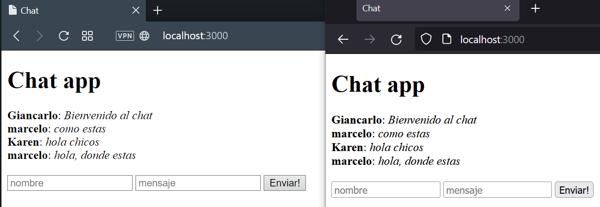
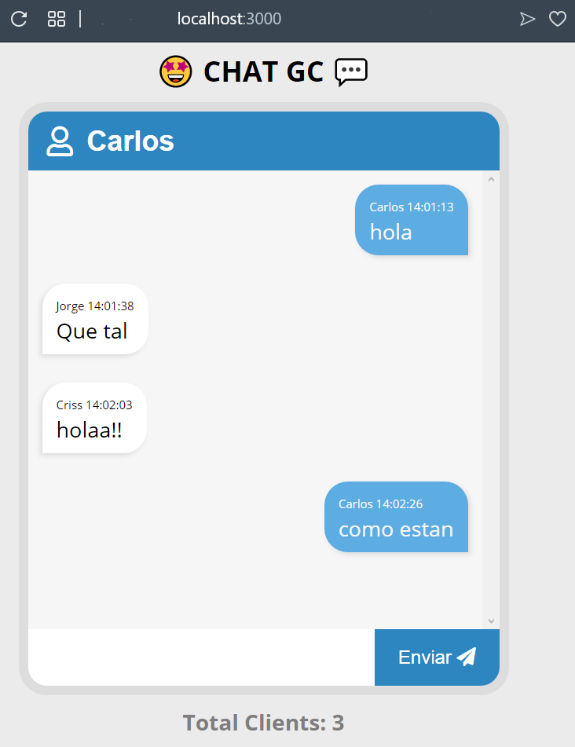
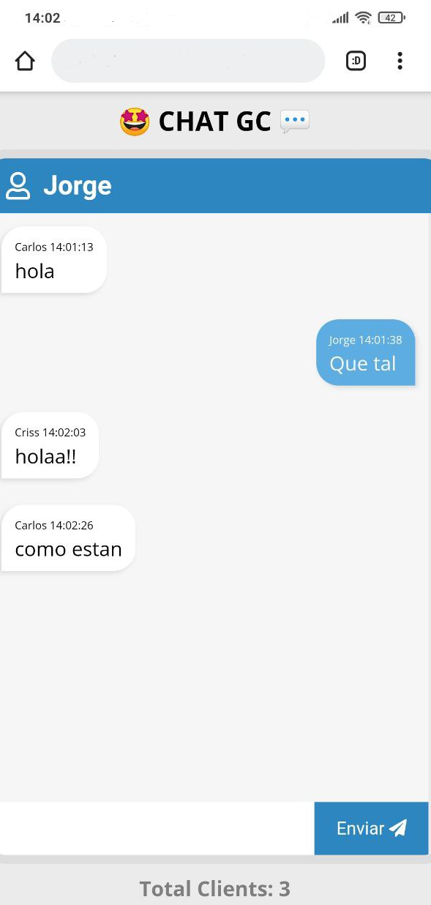

# Websockets -- socket.io

## Ejecutar
`$ npm install`  
`$ npm start`

## Abrir navegador web
http://localhost:3000

> Servidor por defecto en puerto 3000
### v1.0.0 Mensaje  de ida y vuelta
### v2.0.0 Chat basico

### v2.0.0 Chat basico con estilos

